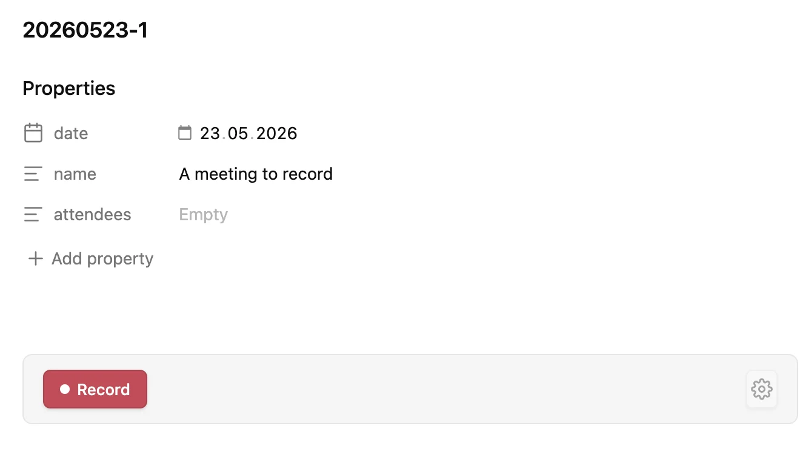
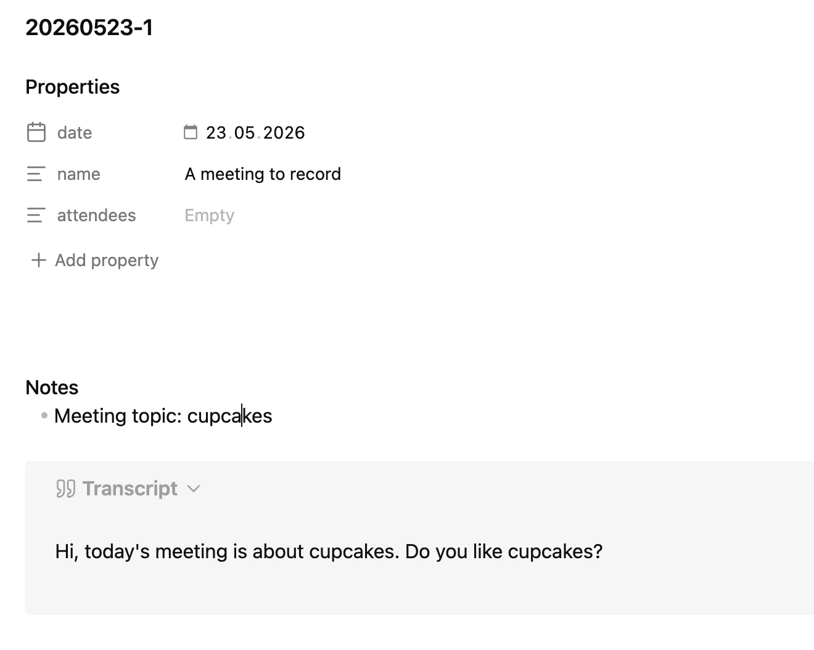

# Meeting Recorder

An Obsidian plugin that records meetings, transcribes them live with [Whisper](https://github.com/ggml-org/whisper.cpp), and generates a structured summary with [Claude](https://claude.com/claude-code) — all locally, in the current note.

Works on **macOS** and **Windows** (desktop only).

## What it does

Insert a recorder into any note via the command palette → **Insert Meeting Recorder**, hit **Record**, talk. While you record, Whisper transcribes chunks every 30s and writes them straight into the note. On **Stop**, the transcript is folded into a `> [!quote]- Transcript` callout and Claude appends a summary with action items, decisions, and notes.

Works especially well dropped into a meeting template — the recorder lives in the note itself, so each new meeting starts ready to go.




## Install

1. Clone or download this repo.
2. Copy `main.js`, `manifest.json`, and `styles.css` into `<your-vault>/.obsidian/plugins/meeting-recorder/`.
3. Enable **Meeting Recorder** in Obsidian → Settings → Community plugins.

## Prerequisites

You need these installed and on your `PATH`:

| Tool | Purpose | Install |
|------|---------|---------|
| [whisper.cpp](https://github.com/ggml-org/whisper.cpp) | Local transcription (provides `whisper-cli`) | macOS: `brew install whisper-cpp` · Windows: build from source or grab a release binary |
| A Whisper GGML model | Used by `whisper-cli` | Download from [Hugging Face](https://huggingface.co/ggerganov/whisper.cpp/tree/main) — e.g. `ggml-large-v3-turbo.bin` |
| [Claude Code CLI](https://docs.claude.com/en/docs/claude-code/quickstart) | Summary generation | `npm install -g @anthropic-ai/claude-code`, then run `claude` once to sign in |

For **system audio capture** (recording the other side of a call, not just your mic):

| Platform | Tool | Install |
|----------|------|---------|
| macOS | [BlackHole](https://existential.audio/blackhole/) + a Multi-Output Device (Audio MIDI Setup) | `brew install blackhole-2ch` |
| Windows | [VB-CABLE](https://vb-audio.com/Cable/) | Download installer from VB-Audio |

Mic-only recording works with no extra setup.

## Configure

In Obsidian → Settings → **Meeting Recorder**:

- **Whisper binary** — usually just `whisper-cli` if it's on PATH.
- **Models directory** — folder containing your `.bin` model files.
- **Audio input** — `mic`, `system`, or `both`.

### macOS — system audio

Create a Multi-Output Device in Audio MIDI Setup that includes your real output (Speakers/AirPods) **and** BlackHole 2ch. Add a row under **Device mappings** that maps your output device name to that Multi-Output Device name. When you hit Record, the plugin switches your output to the Multi-Output Device and restores it on Stop.

### Windows — system audio

In Windows sound settings, set your **default playback device** to `CABLE Input (VB-Audio Virtual Cable)` before recording. To still hear the meeting, enable **Listen to this device** on the CABLE Input properties and route it to your real speakers — or use [VoiceMeeter](https://vb-audio.com/Voicemeeter/) for cleaner routing.

The plugin captures from any input device whose name contains `blackhole`, `cable`, or `vb-audio`.

## Build from source

```bash
npm install
npm run build
```

Outputs `main.js` next to `manifest.json` and `styles.css`.

## License

MIT
